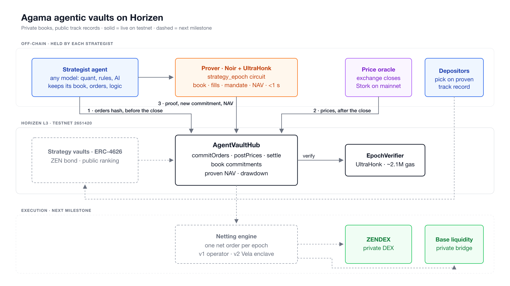
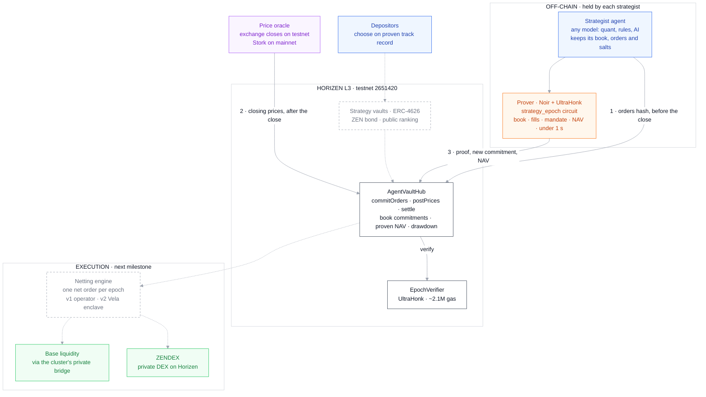

# Agama agentic vaults

**Private books, public track records. A working start on Horizen RFP 1, private agentic trading vaults.**

Horizen's RFP asks for vaults where automated strategies trade for depositors
"without exposing positions, holdings, or strategy logic onchain", and names
the piece that makes an open strategy venue viable: "confidential execution
paired with verifiable performance attestation". This repository is the
attestation half, running on Horizen testnet today, built before we asked for
anything.

**▶ 2-minute demo: [youtu.be/Sw_V7lslx4s](https://youtu.be/Sw_V7lslx4s)**, the architecture, the hub on the Horizen
explorer, proofs built and verified, a live epoch on testnet, and an attack refused by the verifier.

The full design, what each milestone adds, and how it maps to the RFP line by
line: [`docs/ARCHITECTURE.md`](docs/ARCHITECTURE.md).

> **Status.** A sandbox, started on 30 September 2026. Strategies trade virtual capital at
> real exchange prices, so every NAV below is proven but none of it is money.
> Netting across strategies, deposits, the ZEN bond and execution venues are
> the next milestone. Nothing is audited.

---

## Architecture

Solid boxes run today on Horizen testnet. Dashed ones are the next milestone.



The same flow as a Mermaid flowchart:



Legend: blue = actor · orange = off-chain component · purple = price feed · green = Horizen app cluster · dark outline = core Agama contract · dashed grey = next milestone.

## What it proves

Each strategy keeps its book off chain. The chain holds a commitment to it and
nothing else. Every epoch runs in an order the contract enforces with time:

1. **Before the epoch closes**, the strategy commits to its orders. Once only.
2. **After it closes**, the oracle posts the closing prices.
3. **The strategy settles** with a proof that its committed orders, filled at
   those prices, move its committed book to a new one that respects its
   mandate, and that the NAV it reports is the value of that book.

What that buys, without trusting the strategy or us:

| A strategy cannot... | because |
|---|---|
| pick its trades with hindsight | orders are fixed before any closing price exists |
| add, drop or resize a trade after the fact | the orders are a public input of the proof, rebuilt by the contract from the commitment |
| report a better NAV | the NAV is an output of the proof |
| invent a starting book | the first epoch starts from a public amount of cash |
| break its mandate | the circuit refuses a book outside the allowed assets or above the weight cap |
| rewrite its history | each proof opens the commitment the previous one produced |

What the chain sees per strategy: its mandate, a commitment, and a proven NAV
with its drawdown. What it never sees: a balance, an order, or the logic that
produced them.

## Live on Horizen testnet

| | |
|---|---|
| AgentVaultHub | [`0x292ED0c07E03Bb4972009Ac2bF1126cD63c1a361`](https://horizen-testnet.explorer.caldera.xyz/address/0x292ED0c07E03Bb4972009Ac2bF1126cD63c1a361) |
| EpochVerifier | [`0x63A1A2bA8a4caDd82e6ff7431b38f695f994AC1f`](https://horizen-testnet.explorer.caldera.xyz/address/0x63A1A2bA8a4caDd82e6ff7431b38f695f994AC1f) |

Two strategies run against it in three-minute epochs, on ETH, BTC and ZEN
closing prices from Binance: a momentum strategy and a mean-reversion one.
Read everything a depositor can see, with no key:

```sh
./deployment/read-state.sh
```

### Track record so far

274 settlements verified on chain. Sandbox capital 1,000,000 USDC per strategy.

| Strategy | Epochs proven | Proven NAV (USDC) | Return | Max drawdown | Last proof |
|---|---|---|---|---|---|
| momentum | 136 | 990,062.51 | -0.994% | 2.04% | [tx](https://horizen-testnet.explorer.caldera.xyz/tx/0x0e3dad3f4f275953ee7aa94dae8adc55105ba596007f2b436fef1dad8e6e176d) |
| mean-reversion | 136 | 951,862.53 | -4.814% | 8.04% | [tx](https://horizen-testnet.explorer.caldera.xyz/tx/0x09c912fd0bc82eb2a7e297985dec4de9c3b00f8749ec04e6a43cdf2416ecb1de) |

The balances behind those numbers, and the orders that moved them, are not on chain.

The strategies are deliberately simple, three-minute epochs and a 40% cap per asset, and they trade real prices: ZEN and ETH dropped and then recovered across the runs, and the record shows both legs, losses published exactly like gains. That is the point of a proven track record: nothing is picked after the fact, and each figure links to the transaction that verified it. The page in [`docs/index.html`](docs/index.html) draws the same record live from the chain.

## Attacks, mined on chain

Three attacks sent as real transactions from a separate test strategy, mined, and reverted. Each one was set up so that every check before the targeted one passes, and the revert data was decoded to confirm which check refused it. Details in [`deployment/attacks.json`](deployment/attacks.json).

| Attack | What was sent | Refused by | Mined tx | Then, honestly |
|---|---|---|---|---|
| late orders | orders committed for an epoch that had closed | `EpochClosed` | [tx](https://horizen-testnet.explorer.caldera.xyz/tx/0x2512b5375699e8603d3fc2a408cb885cef8933ec55b7805f0e6d8bc993ca4727) | n/a |
| inflated NAV | a valid proof, with 100,000 USDC added to the NAV beside it | `SumcheckFailed` | [tx](https://horizen-testnet.explorer.caldera.xyz/tx/0x161da98eb45eff75807491520aba414ab17925266e3055cb09737610fce645a4) | [settled](https://horizen-testnet.explorer.caldera.xyz/tx/0x08b709026444ebb205e8ad2d6482609bc87bd148a8a30c0073233f1c363bd9dc) |
| swapped orders | one order set committed, a larger one proven | `SumcheckFailed` | [tx](https://horizen-testnet.explorer.caldera.xyz/tx/0xcf2a3118dbfc69488c6c25efa4d25d1baa6a0f315c521fffc7b2c887074743b9) | [settled](https://horizen-testnet.explorer.caldera.xyz/tx/0x000654bebdcf2300832d6b9befefb40d62d3b9167e346c24314cdf469389bd2e) |

Where the verifier refuses, the same strategy settles honestly right after, with the same proof and the true NAV, or with the orders it actually committed. The attack was the only thing wrong. The full transaction log of the run is in [`deployment/testnet-log.jsonl`](deployment/testnet-log.jsonl).

## Check it yourself

Nothing here needs trusting us. From a clean checkout:

```sh
./zk/prove.sh                          # rebuild circuits, verifier and proofs from source
git status                             # stays clean: the committed artefacts are what the source produces
cd contracts && forge test && cd ..    # 12 tests against real proofs
python3 deployment/verify-bytecode.py  # the deployed contracts are this code, immutables included
./deployment/read-state.sh             # every public fact, keyless
python3 deployment/report.py           # the tables above, rebuilt from chain data
```

## Layout

| Path | What |
|---|---|
| `zk/strategy_epoch/` | the settlement circuit, Noir, with its own tests |
| `zk/order_commit/` | off-chain helper that computes an order commitment with the same hash |
| `zk/prover.py` | nargo + bb wrapper: commit, execute, prove (UltraHonk, keccak transcript) |
| `zk/prove.sh` | rebuilds every circuit artefact from source |
| `contracts/src/AgentVaultHub.sol` | registry, order commitments, closing prices, proven settlement |
| `contracts/src/EpochVerifier.sol` | generated by `bb write_solidity_verifier` |
| `contracts/test/` | the honest path and every refusal, against real proofs |
| `agents/` | the two strategies, the live runner, the attack script |
| `deployment/` | addresses, transaction log, public state reader, bytecode check, report |
| `docs/` | architecture and milestones, the diagrams (Mermaid source and rendered), the live track record page |

Settlement costs about 2.1M gas, most of it the UltraHonk verifier, which is a
fraction of a cent on Horizen. Proving takes under a second on a laptop.

## What comes next

The RFP's other half is confidential execution. The next milestone adds it:

- **netting across strategies**: one batch per epoch, opposite orders crossed
  at the closing price, a single net order sent to market, so no strategy's
  trade history can be read back from the chain
- **vaults with real deposits**, one ERC-4626 per strategy, priced at the
  proven NAV
- **the strategy lifecycle** the RFP asks about: sandbox, incubation, open,
  with a public ranking computed from proven figures and a strategist bond in
  ZEN sized to the capital a strategy may manage
- **execution venues**: ZENDEX on Horizen, and Base liquidity
- **operator blindness**: netting inside a Vela enclave once Vela runs on
  Horizen with hardware attestation

## Built on

The proving pipeline, the commit-before-outcome pattern and the testing
discipline come from our earlier Horizen work,
[agamafinance/agama-horizen](https://github.com/agamafinance/agama-horizen),
where the same approach attests a private credit book on Horizen testnet.
