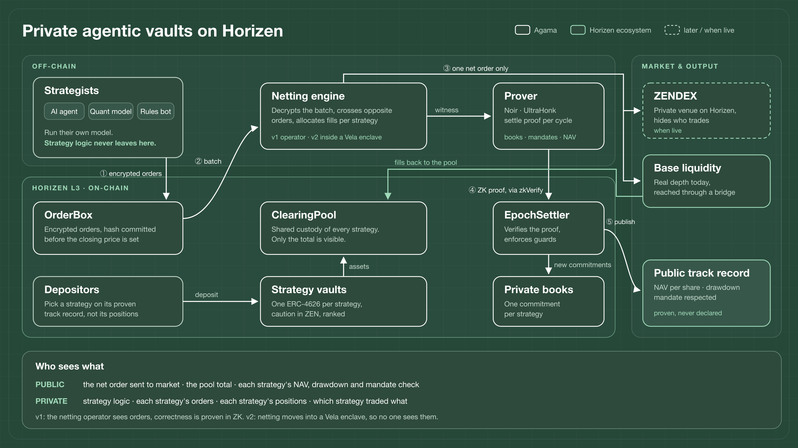

# Architecture and milestones

This document describes the full protocol this repository is the start of,
what is already running, and what each milestone adds. It follows the order of
Horizen's RFP 1, private agentic trading vaults.

## The RFP, line by line

| The RFP asks for | How the design answers |
|---|---|
| automated strategies (quant, rules, AI agents) trading for depositors | one vault per strategy; depositors choose a strategy, the strategy trades that vault's capital |
| not exposing strategy logic on chain | logic never reaches the chain: the strategist runs its model on its own infrastructure and only sends encrypted orders |
| not exposing positions or holdings | each strategy's book is private and only committed to on chain; assets sit in a shared pool, so the chain sees a total, never a strategy's share |
| a strategy that cannot be reverse-engineered from its trade history | orders are batched per epoch and netted across strategies; only the net order reaches the market |
| verifiable performance attestation | every epoch, a ZK proof that the new book is the old book plus real fills, that the mandate holds, and that the NAV is the value of that book at posted prices **(running, see the README)** |
| where strategies come from, how they are onboarded and ranked | open registration through an SDK; sandbox, then incubation, then open to depositors; a public ranking computed from proven figures only |
| how the protocol accrues fees | management and performance fees above a high-water mark, an execution fee on routed volume, and a share of the saving from internal netting |
| integration with the cluster's private venues and with Base liquidity | the net order executes on ZENDEX on Horizen, or against Base liquidity through a private bridge |
| ZEN in the tokenomics | a strategist bond in ZEN sized to the capital a strategy may manage, and a share of protocol revenue to ZEN staking |
| Horizen as the privacy coordination and execution layer | books, orders, proofs, ranking, bonds and fees live on Horizen; Base provides liquidity only |

## One epoch

1. Strategists send encrypted orders. The hash of each order set is committed on chain before the epoch closes. **(running)**
2. After the close, the oracle posts closing prices. **(running, exchange prices on testnet, Stork on mainnet)**
3. The netting engine crosses opposite orders between strategies at the closing price.
4. The net order executes once, on ZENDEX or against Base liquidity. Fills are allocated back per strategy.
5. Proofs: one for the netting, one per strategy for its book, mandate and NAV. **(the per-strategy proof is running)**
6. Per strategy, the chain records a new commitment, a NAV per share, a drawdown and a mandate check. **(running)**
7. The contract enforces the guards on its own: a drawdown beyond the declared limit freezes new orders, a missing proof suspends the strategy.

## Who sees what

| | Public | Netting operator (v1) | Strategist | Depositor |
|---|---|---|---|---|
| strategy logic | no | no | yes | no |
| orders | a hash | yes | its own | no |
| a strategy's holdings | a commitment | yes | its own | no |
| pool total | yes | yes | yes | yes |
| NAV, drawdown, mandate check | yes | yes | yes | yes |
| the net order sent to market | yes, not attributable | yes | no | no |

**Trust model, stated plainly.** In v1, correctness is proven and needs no
trust, but the netting operator sees orders in order to net them. In v2 netting
moves into a Vela enclave, so no one sees them, and the proofs stay as a second
line of defence.

**A leak most designs miss.** Frequent public returns on a small asset set let
anyone regress a strategy's exposures. Public figures are therefore published
at a lower frequency, with detail at full frequency for depositors and auditors
through a viewing key. Solvency and mandate checks stay per epoch.

## Strategy lifecycle

1. **Sandbox.** Virtual capital at real prices, commit-before-outcome and
   proofs exactly as in production. A strategy builds a proven track record
   before it manages a dollar. This is what runs today.
2. **Incubation.** Small, capped capital.
3. **Open.** External depositors, once a strategy has enough proven epochs and
   stays inside its risk limits.

The capital a strategy may manage scales with its ZEN bond and its proven
record. The mandate cannot be broken, the proof forbids it, so the bond covers
what the proof cannot: a strategy that understated its risk and breaches the
drawdown it declared.

## Milestones

| | Scope | Evidence of completion |
|---|---|---|
| **M0, done** | per-strategy proof of book, mandate and NAV; commit-before-outcome; hub and verifier on Horizen testnet; two sandbox strategies over 13 epochs; three attacks refused on chain | this repository, `deployment/verify-bytecode.py`, `deployment/read-state.sh` |
| **M1, the hard part** | netting across strategies with its own proof; shared pool; ERC-4626 vault per strategy priced at proven NAV; ZEN bond and mandate registry; strategist SDK; three or more strategies including two external ones over two weeks of hourly epochs; a public attack suite covering every guard | public repository, source-verified contracts, keyless state reader, transaction hashes |
| **M2, audit** | contracts and Noir circuits audited by a Foundation-approved auditor; fixes; public report | the report |
| **M3, mainnet usage** | mainnet launch tied to ZENDEX mainnet, or a fixed date with Base execution if ZENDEX is not live; three months measured on the RFP's metrics: execution volume routed, active strategies with external depositors, unique depositors, total deposited, fee revenue | on-chain figures |

## Known limits

- v1 netting operator sees orders (closed in v2 by Vela).
- Epoch-based, so medium-frequency strategies, not high-frequency trading.
- The starting asset set is what bridges to Horizen: USDC, ETH, BTC, ZEN.
- The pool total is public; a minimum number of active strategies per pool keeps it from describing a single one.
- Books have a fixed number of assets per circuit; recursive aggregation comes later.
